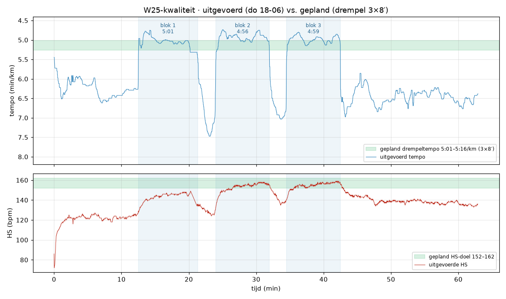

# Trainingsweek 2026-W25  ·  15-06 → 21-06-2026

> **Terugblik week 2026-W24** (08-06 → 14-06): 3 runs · **34.8 km** · 3:28:54 · gem HS 134 · belasting 312 TRIMP
> Eén document per week: terugblik op de vorige week + trainingsschema voor deze week. De coach-analyse onderaan blijft behouden bij verversen.

---

## 1. Terugblik — de runs van week W24

| Dag | Type | km | Tempo | Gem HS | Max | Cadans | TRIMP | TE |
|---|---|---|---|---|---|---|---|---|
| Di 09-06 | 🟢 Rustige duurloop | 11.9 | 5:55 | 135 (67%) | 150 | 166 | 108 | 3.9 |
| Vr 12-06 | 🔴 Intervaltraining | 11.0 | 5:48 | 139 (70%) | 163 | 164 | 110 | 4.3 |
| Zo 14-06 | 🔵 Herstelloop | 11.9 | 6:14 | 128 (61%) | 138 | 164 | 94 | 3.6 |

### Splits per km — _tempo(HS)_

- **Di 09-06** (11.9 km): 6:09(127) · 5:47(135) · 6:02(134) · 6:14(135) · 6:01(131) · 6:00(135) · 5:59(136) · 6:05(133) · 5:55(135) · 5:31(141) · 5:28(144) · 5:48(139)
- **Vr 12-06** (11.0 km): 6:20(113) · 6:26(124) · 6:21(126) · 4:45(147) · 6:54(135) · 4:39(151) · 6:26(139) · 4:38(155) · 7:02(141) · 4:39(157) · 6:20(145) · 6:18(143) · 6:24(141) · 6:23(139)
- **Zo 14-06** (11.9 km): 6:24(118) · 6:01(127) · 6:14(127) · 6:17(131) · 6:05(128) · 6:09(130) · 6:00(130) · 6:19(128) · 6:21(129) · 6:13(130) · 6:18(130) · 6:16(131) · 6:18(130)

### Tijd per hartslagzone

| Zone | Min | Aandeel | |
|---|---|---|---|
| Herstel | 22 | 11% | ██ |
| Rustig (Z2) | 153 | 73% | ███████████████ |
| Matig (grijs) | 24 | 12% | ██ |
| Drempel | 9 | 4% | █ |

**Intensiteitsverdeling:** 84% rustig/aeroob, 16% matig+intensief. ⚠️ 12% in de grijze zone (142–152) — mijden op easy dagen.

---

## 2. Uitgevoerd deze week (W25 — t/m do 18-06)

| Dag | Type | km | Tempo | Gem HS | Max | Cadans | TRIMP | TE |
|---|---|---|---|---|---|---|---|---|
| Di 16-06 | 🟢 Rustige duurloop | 10.7 | 6:07 | 135 (67%) | 143 | 162 | 100 | 3.7 |
| Do 18-06 | 🟠 Drempel 3×8′ | 10.7 | 5:45 | 139 (70%) | 159 | 168 | 106 | 4.3 |

> 2 sessies gedaan · **21.4 km** tot nu toe · nog **Vr** + **Zo** te gaan (zie schema).

### Splits per km — _tempo(HS)_

- **Di 16-06** (10.7 km): 5:55(126) · 5:56(134) · 5:55(136) · 6:03(137) · 6:12(137) · 6:08(137) · 6:12(136) · 6:13(137) · 6:16(137) · 6:15(136) · 6:11(137)
- **Do 18-06** (10.7 km): 6:04(119) · 6:22(123) · 4:57(142) · 5:06(146) · 6:54(129) · 4:54(150) · 4:54(156) · 6:44(143) · 4:56(153) · 5:00(157) · 6:28(144) · 6:28(138) · 6:21(138) · 6:31(136)

### Uitgevoerd vs. gepland

| Dag | Gepland | Uitgevoerd | |
|---|---|---|---|
| Di | Rustige duurloop ~10 km @ 6:12–6:42 | 10.7 km @ 6:07, HS 135 | ✅ zoals gepland (eerste km's net sneller, HS netjes in Z2) |
| Do | Herstelloop ~5 km óf rust | **Kwaliteit i.p.v. herstel:** drempel **3×8′** @ 5:01/4:56/4:59, HS-piek 159 (totaal 10.7 km) | 🔄 dag verschoven — exact de geplande 3×8′-drempel, maar op do i.p.v. vr |

**Gevolg voor de rest van de week:** de kwaliteitsprikkel is binnen (do). Doe **vrijdag dus géén tweede drempel** — vervang door rust of een korte herstelloop, en houd de lange duurloop zondag aan. Zie het bijgewerkte schema.

### Grafiek — uitgevoerd vs. gepland (do 18-06)

_Blauw = uitgevoerd tempo · rood = uitgevoerde HS · groene band = het geplande doel (drempeltempo 5:01–5:16/km, HS 152–162). De drie blauw-gearceerde zones zijn de gedetecteerde werkblokken._

**Uitvoering — schoolvoorbeeld.** De per-seconde-data (1 punt/s, uit `garmin.db`) laat zien dat dit géén losse km-reps waren maar **3 echte blokken van ~8 minuten** — precies het geplande 3×8′ (24′ drempelvolume):

| Blok | Duur | Afstand | Tempo | HS gem / piek |
|---|---|---|---|---|
| 1 | 8:49 | 1568 m | **5:01** | 143 / 149 |
| 2 | 7:57 | 1612 m | **4:56** | 152 / 158 |
| 3 | 7:58 | 1598 m | **4:59** | 154 / 159 |

- **Tempo strak op doel.** 5:01 → 4:56 → 4:59: blok 1 exact op de bovenrand van de band, blok 2–3 een fractie sneller. <5 s spreiding tussen de blokken = uitstekende pacing, geen uitschieters.
- **HS keurig oplopend de doelband in.** Blok 1 zat qua HS nog *onder* het doel (143/149) terwijl het tempo al op 5:01 lag — je was fris en aeroob efficiënt; de hartslagkosten stegen pas in blok 2–3 (152–159), normale cardiac drift bij gelijk tempo. **Geen enkel blok boven 162** → niets geforceerd, mooi binnen de drempel gebleven (geen VO2-overschot).
- **Volledig herstel tussen de blokken.** Tempo terug naar ~7:00, HS zakt naar ~125–130 vóór het volgende blok — precies wat je wil bij drempelwerk.
- **Nette omkadering.** ~12′ opbouwende warming-up (7:00 → 6:00) en ~20′ rustige cooldown. Easy was echt easy.

**Conclusie:** tempo onder controle, HS net in het doel, perfect consistente blokken, niets overdreven. De enige afwijking t.o.v. het plan is de **dag** (do i.p.v. vr, in plaats van de herstelloop) — daarom: vrijdag geen tweede drempel.

---

## 3. Huidige status & observaties

| Indicator | Waarde | Betekenis |
|---|---|---|
| **ACWR** | **1.24** 🟢 | optimaal (omhoog door de do-kwaliteit) |
| CTL (fitness) | 35 | rustig opbouwen is goed |
| ATL (vermoeidheid) | 52 | |
| TSB (vorm) | -10 | >0 fris · <−20 vermoeid |

- **Status t/m do 18-06** (incl. de 2 W25-runs): ACWR **1.24** (nog optimaal), CTL 35, ATL 52, TSB −10.
- **Kwaliteitsprikkel binnen** (do-drempel) ✅ — vrijdag geen tweede harde dag stapelen.
- **Intensiteit van deze 2 runs 74/26** — hoger dan normaal omdat 1 van de 2 runs kwaliteit was; met de lange duurloop van zondag erbij zakt dit weer richting polair. Geen probleem zolang vrijdag easy/rust is.
- ⚠️ **Grijze zone ~17%** in deze 2 runs — vooral uit de dribbelpauzes op do; let erop bij je gewone duurlopen.
- **Cadans di 162 / do 168** — donderdag al op doel (168–172), dinsdag nog aan de lage kant.

---

## 4. Actuele trainingszones

| Zone | Hartslag | Richttempo |
|---|---|---|
| Herstel | 114–127 | 6:40–7:05 |
| **Rustig (Z2 — basis)** | **127–142** | **6:10–6:40** |
| Matig (grijze zone — mijden) | 142–152 | — |
| Lange duurloop | 127–142 | 6:15–6:50 |
| **Drempel/tempo** | **152–162** | **5:01–5:16** |
| **Interval (VO2max)** | **162–170** | **4:43–4:58** (1000 m) |
| Strides (15 s) | — | 4:01–4:26 |

_Afgeleid uit je recente lopen (rust-HS 52, HRmax-model 176); drempeltempo geschat op **5:01/km** uit je beste recente inspanning op 2026-06-06. Past zich automatisch aan._

---

## 5. Trainingsschema deze week (2026-W25)

**Doelvolume: ~38 km** (+10%-regel) · max één harde dag · 2× kracht. _Bijgewerkt 18-06 na di+do._

| Dag | Sessie | Detail | Status |
|---|---|---|---|
| Maandag | **Rust of kracht** | 20–30′ kracht (squat/lunge/calf/romp) óf volledige rust. | — |
| Dinsdag | **Rustige duurloop** | ~10 km @ 6:12–6:42/km — HS 127–142. | ✅ **Gedaan** — 10.7 km @ 6:07, HS 135 |
| Woensdag | **Kracht** | Krachttraining 25–30′ — dé blessurebuffer op 54 j. | — |
| Donderdag | ~~Herstelloop ~5 km~~ → **Drempel** | Week-kwaliteit naar voren gehaald. | 🔄 **Gedaan als kwaliteit** — drempel 3×8′ @ 5:01/4:56/4:59, HS-piek 159 |
| Vrijdag | **Rust of korte herstelloop** | ⚠️ Kwaliteit is al binnen (do) → **géén tweede drempel**. Rust, óf 4–5 km heel easy @ 6:40–7:05/km, HS <127. | ⏳ te gaan |
| Zaterdag | **Rust** | Volledige rustdag (min. 48 u tot de lange duurloop). | ⏳ te gaan |
| Zondag | **Lange duurloop ~14 km** | 14 km gelijkmatig @ 6:15–6:50/km — HS 127–142. Eerste 3 km bewust traag, vroeg starten i.v.m. hitte. Laatste 2 km iets vlotter mag. | ⏳ te gaan · HS-alarm >142 |

> **Weekprojectie:** 21.4 km gedaan + (vr 0–5) + zo ~14 = **~35–40 km**, één kwaliteit. Netjes binnen het plafond.

> Richttempo's passen zich automatisch aan je nieuwste data aan. Grijze zone (142–152 HS) bewust mijden op easy dagen.

---

## 6. Coach-analyse (handmatig)

<!-- COACH-ANALYSE:START — handmatig, blijft behouden bij verversen -->

### Mid-week update — do 18-06 (na di + do)

Twee runs erop en het loopt netjes:
- **Di — 10,7 km @ 6:07, HS 135.** Rustige duurloop zoals gepland. Eerste 3 km net aan de snelle kant (5:55) maar HS bleef keurig in Z2 (126–137); daarna mooi vlak. Cadans 162 — nog je werkpunt.
- **Do — drempel 3×8′ (10,7 km).** Je hebt de week-kwaliteit van vrijdag naar donderdag gehaald en exact als **3×8′** gelopen (8:49 / 7:57 / 7:58 @ 5:01 / 4:56 / 4:59, HS-piek 159, anaerobe TE 0,0). Zie de grafiek in §2: tempo strak op de geplande band, HS keurig oplopend de doelzone (152–162) in, géén blok erboven. Schoolvoorbeeld van een drempelsessie — geen VO2-overschot, lagere blessurelast. Cadans 168 (op doel 👍). _(De per-seconde-data uit `garmin.db` corrigeert mijn eerdere lezing op de auto-laps: het waren 3×8′-blokken, geen losse km-reps.)_

**Bijsturing rest van de week:** kwaliteit is binnen → **vrijdag géén tweede drempel**. Maak er rust of 4–5 km heel easy van. Houd de **lange duurloop zondag ~14 km** aan (eerste 3 km bewust traag, vroeg starten i.v.m. hitte). Zo blijf je op ~35–40 km met één kwaliteit — netjes binnen het plafond; ACWR 1,24 is nog oké maar niet verder opjagen.

---

**Korte versie:** een modelweek qua structuur. Eén kwaliteit (vr), één rustige met progressie-slot (di), één echte herstelloop (zo). Easy was echt easy — precies de discipline die je historisch miste.

**Per run**
- **Di — 11,9 km @ 5:56, HS 135.** Gecontroleerde Z2-duurloop met bewuste progressie op het eind (km 10–11: 5:31 en 5:28, HS 141–144). Zo hoort een rustige loop: aeroob blijven, pas laat aanzetten.
- **Vr — interval 4×1000 m @ ~4:40.** Je kwaliteitssessie, goed uitgevoerd. Reps in 4:45 / 4:39 / 4:38 / 4:39 — *interval-tempo*, zelfs iets sneller dan richtwaarde. HS liep per rep netjes op (147→157, piek 163 = 89% HSR), normale cardiac drift bij gelijk tempo. Anaerobe TE 2,4 bevestigt de echte VO2-prikkel. Constante reps ondanks oplopende vermoeidheid = sterke pacing.
- **Zo — 11,9 km @ 6:14, HS 128.** Tekstboek-herstel. Vroege start (04:29, slim vóór de hitte), vlak gereden, anaeroob 0,0. Ego thuisgelaten. 👏

**Nuance bij de 12% "grijze zone":** die komt vrijwel volledig uit de *dribbelpauzes tussen de intervals* (HS 142–147) en de progressie-finish op dinsdag — niet uit te hard gelopen easy runs. Dus geen echt probleem deze week; blijf het wel in de gaten houden op je gewone duurlopen.

**Aandachtspunten**
1. **TSB −10, ATL 49 > CTL 33.** Je draagt wat vermoeidheid mee en je fitnessbasis is nog laag (opbouw na het gat van 188 dagen). → komende week consolideren, géén tweede harde dag.
2. **Cadans ~164–166.** Aan de lage kant; richt op 168–172 (kortere pas, minder impact). Gratis blessurerem gezien je geschiedenis.
3. **Alle runs 11–12 km.** Wat meer spreiding mag: een kortere herstelloop en een iets langere duurloop (zie schema W25).

**Rode draad:** je doet het goed. Niet versnellen in opbouw — consistentie ís de winst. Plafond ~38–42 km/week, elke 4e week terugloop (~28 km), max één kwaliteit zolang CTL < ~40, en 2× kracht. Volgende kwaliteit = **drempel** i.p.v. interval: bouwt je 10k-motor met lagere blessurelast.

---

### Gedetailleerde sessie-uitwerking W25 (bij het schema hierboven)

**Di — Rustige duurloop ~10 km + strides.** Tempo 6:12–6:42, HS 127–142; voel je 142 naderen op vlak terrein → inhouden. *Cadans-cue:* kies 2–3 km in het midden waar je bewust ~5% sneller voetafzet maakt (kortere pas, zelfde tempo, gevoel "168–172"). Sluit af met **4× 15 s strides** @ 4:01–4:26 met volledige wandelrust — houdt je benen snel zonder belasting.

**Vr — Drempel 3×8′ (de week-kwaliteit).**
- *Opwarming ~2 km:* van ~7:00 oplopend naar 6:15/km tot HS ~130, + 3× 15 s versnellingen.
- *Hoofddeel:* **3 × 8′ @ 5:01–5:16/km, HS 152–162** ("comfortabel zwaar" — losse woorden lukken, zinnen niet). Tussen de blokken **2:30 rustig dribbelen** (~7:00–7:30). Laatste blok = eerste blok qua tempo; eindig met het gevoel dat een 4e blok zou kunnen.
- *Cooldown ~1,5 km* uitlopen tot HS ~115 + licht rekken.
- *Waarom 3×8′ i.p.v. opnieuw interval?* Bijna hetzelfde drempelvolume (24′), maar lagere mechanische en mentale last — passend nu TSB −10. Drempel bouwt je 10k-motor met minder blessurerisico dan VO2-intervallen.
- *Afbreken* bij richttempo dat blok 3 niet meer haalt zonder HS >165, of bij beginnende zeurpijn → stop na 2 blokken, prikkel is binnen.

**Zo — Lange duurloop ~14 km.** Gelijkmatig 6:17–6:52, HS 127–142; eerste 3 km bewust traag. Langste run sinds de herstart (+2 km t.o.v. W24). Laatste 2 km optioneel iets vlotter (richting 6:00, HS tot ~145) **alleen** als de benen dat zelf aangeven. *Hitte-strategie (juni):* start vroeg (vóór 7:00, zoals zondag), water mee of fonteinpunt vanaf km 8, schaduwrijk/vlak parcours. Bij >25 °C op HS sturen, niet op de klok.

**Kracht (2×, ma + wo, 25–30′).** Ma: squats · split squats/lunges · kuitheffen (ook single-leg) · plank + side-plank. Wo: romanian deadlift/hip-hinge · step-ups · single-leg calf raises · dead bug/bird-dog. Kuit- en heupkracht zijn voor jouw geschiedenis (achillespees/knie) het belangrijkst — liever licht en consistent dan zwaar en sporadisch.

**Waarschuwingssignalen → terugschakelen:** rust-HS 's ochtends >58–60 → rustdag · gelijk tempo bij hogere HS → onderherstel, sla de kwaliteit over · beginnende zeurpijn (achillespees/knie/scheen) → **direct 2–3 dagen rust** (historisch jouw crash-punt).

<!-- COACH-ANALYSE:END -->

---

*Bijgewerkt 2026-06-18 (mid-week, di+do verwerkt) · oorspronkelijk gegenereerd 2026-06-14 · TRIMP/CTL/ATL/TSB/ACWR*
